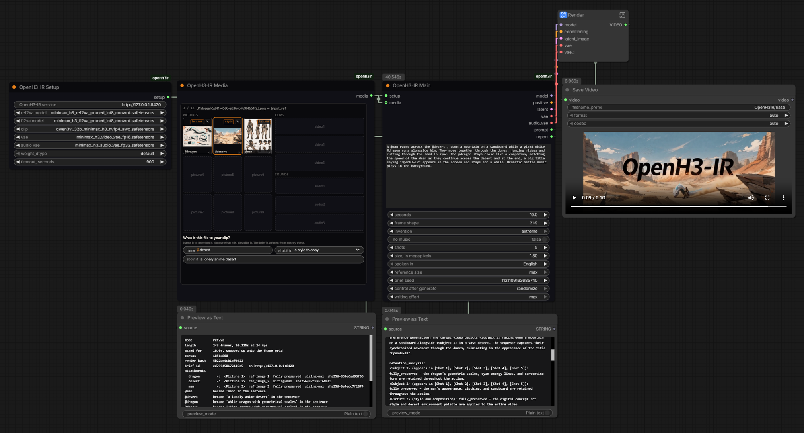
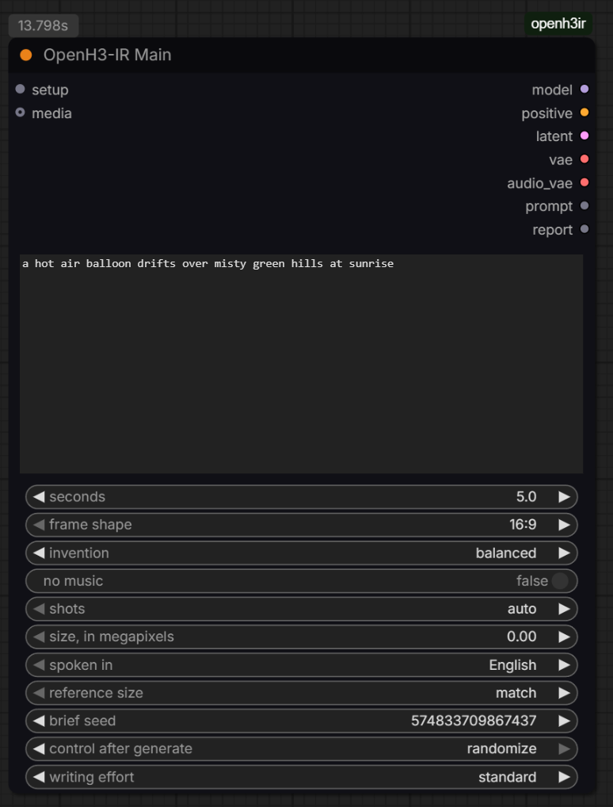
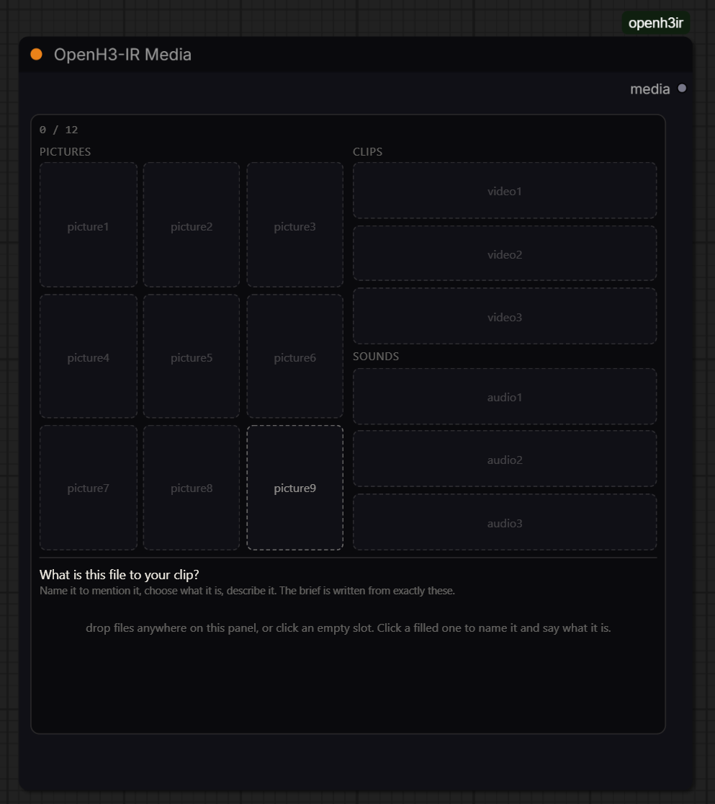
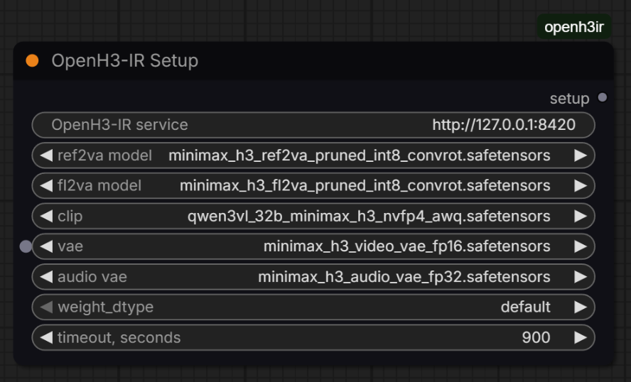

# OpenH3-IR for ComfyUI

Type one sentence. Get a MiniMax H3 render that is ready to run.



*The workflow that ships with this pack, in use. Three nodes, a box called Render, and the video it
just made playing in the save.*

This repository is the ComfyUI half of [OpenH3-IR](https://github.com/ruashots/open-h3-ir), which is one compiler with two
front doors onto it: these four nodes, and an HTTP service anything else can call. Both doors run the same
service. What the compiler does to a render, shown side by side, is on that page.

One node writes the brief H3 actually wants, opens the H3 files this particular job needs, and hands
the render everything it takes to run. There is no text box to paste a document into, no resolution
picker, no frame-count arithmetic and no row of file loaders.

Four nodes in all, and most pieces use two of them. The first holds the prompt and its knobs. The
second holds everything the piece looks at or listens to. The third holds the five H3 files. The
fourth gives the video a director. A piece with no media needs only the first and the third.

## What you need

An OpenH3-IR service. Start it with `h3ir serve`, which listens on port 8420. It needs
`H3IR_LLM_URL` pointing at your own OpenAI-compatible endpoint, and no GPU of its own. The
[compiler's README](https://github.com/ruashots/open-h3-ir#readme) covers it.

A ComfyUI with the MiniMax H3 nodes, which ship with ComfyUI itself, and H3's model files.

## Install

Search for **OpenH3-IR** in ComfyUI Manager, install it, and restart ComfyUI. Manager clones this
repository into `custom_nodes` and installs what it asks for.

By hand it is the same two steps:

```bash
git clone https://github.com/ruashots/ComfyUI-OpenH3-IR.git /path/to/ComfyUI/custom_nodes/ComfyUI-OpenH3-IR
/path/to/ComfyUI/python -m pip install -r /path/to/ComfyUI/custom_nodes/ComfyUI-OpenH3-IR/requirements.txt
```

That second line installs `open-h3-ir`, the compiler, into the same Python ComfyUI runs. It is the
one thing this pack asks for, and this repository carries no copy of it: a fix to the compiler is a
release of the compiler, and nothing here has to change for it.

The nodes themselves speak HTTP to the service with the standard library only, and they never import
the compiler while ComfyUI is loading them. A compiler that is missing, half-installed or broken
costs you the compile, never the nodes.

The service can also live on another machine. Where it can open your media off disk it does, because
nothing is copied and a long clip costs nothing to hand over. Where it cannot, the nodes send the
bytes to it and name each file by the sha256 of its own contents, so the same file is never sent
twice. There is nothing to configure and no mechanism to choose: the nodes try the paths first, and
send the bytes when no spelling of ComfyUI's folder works. A service on another machine keeps the
uploads for two days, 512 MiB per file at most, and the exact figures come from its own
`/v1/capabilities`.

**The pack and the compiler are updated separately, so the nodes check before they queue.** Before
any media travels, the Main node asks the compiler that is going to write the brief what it
takes. It holds that against what this graph is about to send. Something the service has no name for
stops the queue there. The message names the field or the slot, and which half to update.

Anything else that differs is a line in the report and never stops a render: a job the service takes
that this pack cannot offer yet, a ceiling that moved, directions that are not the ones the service
publishes. A service too old to answer the question at all is one note saying so, and everything it
does understand still works.

Then open the workflow that ships with it, which is already wired and runs on a prompt alone:
[the workflow that ships with this](#the-workflow-that-ships-with-this). That is the fastest way to
see the thing work before you read another word.

## The workflow that ships with this

**`example/openh3ir_base_workflow.json` is the place to start.** Open it, pick your five files on
Setup, type a sentence, run. Seven boxes on the canvas: the three OpenH3-IR nodes, one called
**Render** with the rendering chain folded up inside it, one that saves the video, and two panels
showing the brief that got written and the report of what happened. It ships with an empty tray, so
it runs on a prompt alone until you drop something in.

The picture at the top of this page is that same workflow in use, making the title card on the
[compiler's README](https://github.com/ruashots/open-h3-ir#readme), which is why its tray is not empty there: `@dragon` and `@man` are things
the shot should contain, `@desert` is set to *a style to copy*, and the report along the bottom ties
each of those names to the picture H3 received.

Nothing in it is set up to be fast. It renders H3 as it ships, at plain settings, which makes it the
honest baseline to judge a change against. Everything you would reach for to speed it up lives on
that side of the graph, inside the Render box or just before it, out of the way of the part you are
actually typing into.

One setting inside the Render box is a deliberate choice rather than a default: the scheduler is
**beta**, not `simple`. This chain was copied from Comfy-Org's reference-to-video template. That
template carries a note: beta or normal outperform simple on reference-heavy prompts. Every request
this pack makes is reference-heavy.

The note came across with the template and the widget value did not. That is where `simple` came
from. Beta costs no extra time.

## The four nodes

**OpenH3-IR Main** is the prompt and the knobs. **OpenH3-IR Media** is the tray: everything the
piece looks at or listens to, dropped on one panel. **OpenH3-IR Setup** carries the service address
and the five H3 files. **OpenH3-IR Director** is optional. A director decides whatever your own
prompt leaves open: how it is shot, how it is lit, how it is scored.

Search `h3` and all four come up. `tray` finds the Media node, `director` finds the Director, and
`minimax` finds the Main one.

A text-only piece needs Main and Setup. The moment there is a picture, a clip or a sound, add one
Media node and wire its `media` output into Main.

Wire `report` into ComfyUI's own **Preview as Text** node to read what happened on the canvas.

## The knobs on Main



Eight fields, and the first one is the work:

| field | what it decides |
| --- | --- |
| the prompt box | one plain sentence, saying what happens, with `@` for anything in the tray |
| `seconds` | the only place length is set, snapped onto H3's frame grid once and then used for the brief and the render together |
| `frame shape` | 16:9, 21:9, 4:3, 1:1, 3:4 or 9:16. The canvas is sized from it, so there is no resolution box to keep in step with anything |
| `invention` | how much the writer may add where your prompt is silent: `restrained`, `balanced`, `bold`, `extreme` |
| `no music` | turns off the score only. Ambient and physical sound are still written, because H3 writes sound in the same pass as the picture |
| `shots` | `auto` leaves the edit to the writer. A number from 1 to 10 is kept exactly, and a count that cannot fit the length is refused with the arithmetic, since every shot needs 1.2 seconds |
| `size, in megapixels` | 0 is H3's native size, 768 on the short edge, which is what it was trained at. A stated size runs from 0.25 to 2.5, and is sharper, slower and hungrier for VRAM in proportion |
| `spoken in` | the language every `@speaks` line is spoken in, which becomes the tag H3 reads. It decides nothing while no line is locked |

The last three rows on the node are marked advanced and are rarely touched: `reference size`,
`brief seed` and `writing effort`. `brief seed` changes the writing rather than the picture, so a new
number is a different take on the same prompt. `control after generate` beside it is ComfyUI's own.
It is added to any seed field, and it decides whether that number moves on the next run.

## The tray



Drop files on the OpenH3-IR Media panel, or click an empty slot to browse for them. Pictures, clips
and sounds sort themselves into their sections. Hold a file over the board and the slot it will land
in lights up. The slot shows the name the file is about to be given. Where it is going is settled
before you let go.

Drop a file onto a slot that already holds one and it takes that file's place. The name, the role
and the line you wrote about it all stay. That is how you swap a picture without touching a prompt
that already mentions it.

Two things do not stay, because both were claims about the file that just left. If the new clip has
no soundtrack, that setting is switched off. A sound's typed words are cleared, because they were
the words of a recording that is gone. The panel says which of the two it did.

Nine pictures, three clips and three sounds are H3's own per-kind ceilings. Twelve files in all is
the tray's ceiling. So you cannot fill every slot at once. A file that does not fit is turned away
where you dropped it, with the reason. It is never uploaded.

Every slot carries three things:

**A name.** Auto-given (`picture1`, `video1`, `audio1`) and yours to change, letters, digits and
dashes. The name is how the prompt refers to the file.

The field corrects a name as you type it rather than refusing it when you queue. A space becomes a
dash, and so do an underscore, a dot and a slash, because `the man` typed straight through would run
two words into one and name something else. Accents fold, so josé piñata arrives as jose-pinata. A
character that cannot be in a name never lands, and the panel says which one it turned away. Four
things it cannot fix by correcting, so it declines the name instead and says why: a name that is
empty, a name of nothing but dashes, `speaks`, which is taken because `@speaks(` is how a spoken line
starts, and a name another slot already holds, which is compared without case, so `SHOWROOM` is taken
when the tray shows `showroom`.

**What it is.** A choice in plain words, defaulting to the ordinary reading:

| Kind | The choices |
| --- | --- |
| picture | something in the shot · the setting · a style to copy · add it to the clip · replace the one in the clip · first frame · last frame · storyboard |
| clip | copy what is in it · copy how it is shot · edit it · carry on from it |
| sound | play it · match its style · cut to its beat · sound effect · voice to match |

These decide the brief mechanically rather than by persuasion. A clip set to "edit it" produces an
editing brief, whatever the prompt says. A clip set to "copy how it is shot" lends its structure and
is never cited for anything in it. A track set to "match its style" can never be claimed as copied.
First and last frame switch the job to H3's fl2va model, which takes no references at all, so mixing
frames with reference slots is refused before any model call, with the reason.

A picture's last two choices are both about a clip in the same tray. Both need a clip set to "edit
it". "Add it to the clip" puts what the picture shows into that footage. It takes nothing out.

"Replace the one in the clip" is a swap. Whatever the picture shows takes over from whatever is
there now: the same place in the frame, the same movement, the same timing. The brief also records
that the old one is gone. A person, a car, a dog or a coffee cup all work the same way.

Use either choice without a clip to edit and the service refuses the job in a sentence. A picture
meant to swap something out never becomes one more reference instead.

**What it takes over from.** A picture set to "replace the one in the clip" gets one more field, and
nothing else does. In it you name what in that clip this picture stands in for, in your own words:
"the man in the plaid shirt", or "the red car on the left".

The field sits beside what the picture is, not in place of it. The two fields say different things.
The role says something is replaced. This field says which thing.

The field is free text, because nothing in this chain can list what is in a clip. The service reads
three frames sampled from the clip. Something can be absent from all three and turn up later.
You are the one watching the clip, so you are the one who knows.

One replacement picture never has to name who it replaces. Only one picture is asking, so the
compiler binds it to the one figure of its kind. Two pictures both have to name who they replace.
The panel says so as soon as one of them has not, on the line where it reports everything else. The
brief binds by the words you write, so two pictures can each replace a different person in one edit.

**A line about it.** Optional for pictures, which get looked at. Nearly essential for sounds, which
do not: nothing in this chain can hear, so the line you type is the only thing that will ever know
what a track sounds like. A sound set to "voice to match" or to "play it" takes one thing more, the
words already spoken inside the recording, since nothing here can hear those either.

A clip with its own soundtrack gets one more choice: **off** sends none of it, **paired** sends it
as that clip's own sound, **alone** sends it as a track in its own right.

The tray's whole state is one ordinary field on the node, so a saved workflow and a rendered video
carry it: drag the mp4 back onto the canvas and the slots come back, names, roles and notes intact.
The files themselves live in ComfyUI's input folder; a workflow opened on another machine names
them and asks you to drop them again.

## The @ prompt

The prompt on Main is plain prose, and `@` is how it points at the tray. Type `@` and a picker
pops up with every slot, thumbnails included; keep typing to filter, Enter to insert.

*"@carguy walks onto the wet gantry and stops when he sees @the-city"*

Once it is in the prompt a mention reads as one object, not a run of characters. Two things about
it are visible without clicking anything. The shape says which construct it is: a ring is
a mention, a box is a locked spoken line. The colour says whether the graph will accept it. A mention
of a picture is orange, of a clip teal, of a sound violet, a locked line is green, and red is anything
that will be refused, which is a mention naming a slot the tray does not hold or a spoken line opened
and never closed. Rename a slot and the mentions of its old name turn red where they stand.

Hovering a mention shows what it points at: the picture itself for a picture, a frame from it for a
clip, and for a sound its name and the note you wrote, since there is nothing to look at. The note
shows for the others too.

None of that is stored. The widget's value is the prompt and nothing else, exactly the text you
could have typed by hand, and the drawing sits behind it. Delete `web/` and both nodes still work,
still API-drive, and still restore from a saved workflow, with the prompt visible as itself.

A mention becomes that slot's description in the document, bound mechanically to the file, so the
compiler never guesses which words mean which picture. A mention that names no slot is refused
before any model call, listing the names that exist. Files you never mention still get used, the
compiler weaves them in, and the report tells you they went unmentioned.

Dialogue that must be said exactly is locked inline:

*"the guard turns and @speaks("The gate stays shut tonight.")"*

Whatever is inside `@speaks("...")` comes back in the brief word for word and mark for mark, because
a brief that rewords it is refused and rewritten. Words merely quoted in the prompt stay free for
signs and flavor, and the writer may polish them. The `spoken in` choice names the language of every
locked line. There is no other syntax: mentions, locked lines, prose, nothing else.

The whole construct draws as one green object, the `@speaks`, the brackets, the quotes and the words
together, because they are one thing and splitting them would suggest the quotes are separate from the
line they hold. Green rather than something quieter for a reason worth knowing: this is the one span
in the prompt that reaches the model letter for letter, so it is marked as live, not as inert. Open
one and never close it and the same box turns red, because an unclosed line is refused.

## The five files are yours to pick



The Setup node is a picker and nothing else. Each combo lists what your install actually has, in both
formats, and the file you choose is the file that loads. Nothing here searches by name, prefers a
build, or offers an option meaning "work it out".

That is deliberate, and it is worth saying why, because the node used to do the opposite. A filename
tells you what a file is called. It does not tell you which of two H3 checkpoints you meant, or which
of three encoders you keep for H3, or which build you want today. Answering that question from the
name means the render used a file the canvas never showed, and the one thing this pack will not do is
choose for you quietly. So the pick is on the node where you can read it, changing it is one click,
and the `report` output names every file that was loaded and the loader that read it.

Two of those files are easy to swap, because H3 ships two checkpoints and what the tray says its
pictures are decides which one this job needs: `ref2va` for reference and text jobs, `fl2va` for a
first or last frame. Both load happily in either slot, so if the filename says one family and the
graph is the other, the report says so in plain words and the render still happens:

```
weights        minimax_h3_fl2va_pruned_int8_convrot.safetensors  via UNETLoader
WARNING        minimax_h3_fl2va_pruned_int8_convrot.safetensors names H3's fl2va family, and
               this graph is a reference or text job, which runs on the ref2va checkpoint.
               Check the ref2va model field on the Setup node: it will render either way, and
               it will be wrong in a way nothing on screen explains.
```

It is read from the filename and only where the filename decides the question. A file whose name says
neither family, or both, gets no warning: a renamed file is not evidence of a mistake, and a warning
that fires on no evidence is one people learn to ignore.

Because nothing invents the five files, a graph with no Setup node has nothing to load and says so
before it writes a file or calls anything:

```
Required input is missing: setup
```

That is ComfyUI refusing the graph at validation. Queue one with the socket connected to nothing and
the node says it in its own words: add an OpenH3-IR Setup node, pick the five files, wire it in.

## Who is directing

Nobody, unless you say so. Add an **OpenH3-IR Director** node. Wire it into Main's `director`
socket. Then write in it. Leave it out and the writing behaves exactly as before.

The node holds two things: a name, and the direction itself. The direction is ordinary prose. Write
what the camera does, how tight the framing is, and from what height. Write what the light and the
colour are like, and what the frame pays attention to. Write how bodies move, how lines are
delivered, what the room sounds like, and what a score is made of. Describe habits, not particular
shots.

The name is also how you pick a different direction. Open the list beside it and you see every
direction saved on this ComfyUI. Seven directions ship with the pack, as examples of the shape. Pick
one and its whole text drops into the box. From there, change a line, cut half of it, or leave it as
it is.

Nothing is chosen out of sight. What you can read on the node is exactly what gets sent. Hand
Cameron and Tarantino the same prompt and the two briefs come back different. That is the whole
point.

**The name is for you, not for the model.** Only the direction is sent. Type "Wes Anderson" at a
writing model and it copies famous scenes back at you. That is imitation. The direction describes
how he works instead, and that is the part that can steer a scene he never shot.

So the name reaches the report and your saved workflow, and no further. For the same reason, none of
the seven names a film, quotes a line or lays out a shot. They describe habits instead. That is what
makes them worth editing rather than copying.

**The twenty camera moves.** H3 knows twenty camera moves by name, and that list is closed. Name one
of them and you get the strongest hold there is over the camera. Word the same move your own way and
you measurably get less of it.

The twenty are listed under the box, behind *the twenty camera moves*. It is shut until you open
it. Each of the seven picks its moves from that list, and says which ones to leave alone.

**A direction steers. It does not rule.** The writer gets it as taste. It sits below a statement of
what your prompt and your references already govern. So anything you state yourself outranks it,
one thing at a time. Write "a locked-off wide" and you get a locked-off wide, whoever is directing.
The light and the sound are still theirs.

A direction also never sets how many shots there are. Pin `shots` on Main and the count is yours.
Leave `shots` on `auto` and the writer decides the edit. That is what it does with no Director node
in the graph.

Whatever you write is kept in your saved workflow and in the rendered video's embedded graph. The
media tray is kept the same way. Drag that mp4 back in and the direction comes with it.

**You do not have to save anything.** What you type in the box is already enough. The node carries
what you wrote, and the writing already follows it. You save a direction only so you can pick it
again in another graph.

Name a direction and press **save**. It joins the list, ready to choose in any graph on this
ComfyUI. Change the name of the one you are editing, then press save. It is renamed, not copied.
**forget** deletes the one you are editing. Before either button replaces or deletes a direction
already in the list, the button asks you to press it a second time.

**The seven are only the first seven in that list.** They are written into it the first time you
open the node. After that they are directions like any other. Rename one, edit one, delete one.

None of them is protected and none of them is a category. A deleted one stays deleted. If you want
the shipped seven back, delete the `directors` folder and open the node again.

A direction can run to 5,000 characters. Go over and the count under the box turns red. It names the
limit. The compiler refuses a longer one rather than trimming it. Fix the length here, not at the
queue.

Every direction is a plain file in ComfyUI's own user folder:
`user/default/openh3ir/directors/<name>.json`. Each file holds the two things you typed. You can
read, copy, back up or delete them without this panel.

The list is a convenience, never a dependency. A graph carries the words it was written with, not a
pointer to a name. Send a workflow to somebody whose list is empty and it still compiles exactly
what you wrote.

## Wiring the graph

You do not have to do any of this by hand. The workflow above ships wired, and opening it is the
short way in. This is here for building your own around the nodes.

Setup into Main's `setup`. Media into Main's `media` when there is media. Then the five outputs that
carry the render:

| Out | Into |
| --- | --- |
| `model` | your own model patches, if any, then the guider and scheduler |
| `positive` | the guider's conditioning |
| `latent` | the sampler's latent |
| `vae` | VAE Decode |
| `audio_vae` | VAE Decode Audio |

`prompt` is the compiled brief if you want to keep it, and `report` is an account of what happened:
the job it ran, the real length, every file loaded, what each mention became, and which files went
unmentioned. What stays on your canvas is what you actually tune: the LoRAs, the sigma shift, steps,
the sampler, decode and save.

## Length lives in one place

There is one `seconds` field. H3 only renders on a 17k+5 frame grid, so it is snapped once and that
one number is used for both the brief and the latent. Ask for 10 seconds and you get 10.125, which
matters the first time you cut to a beat. 8.0 is the only whole second on the grid. A second duration
control somewhere else in the graph is how you render eight seconds of a ten second script, so there
isn't one.

The range is 1.0 to 149.0 seconds, which is wider than H3's trained band of 5.167 to 15.083. Outside
the band a render still happens, untested and slower, and the report says so:

```
length         39 frames, 1.625s at 24 fps
asked for      1.0s, snapped up onto the frame grid
note           1.625s is below H3's trained band, which starts at 124 frames, 5.167s. It still
               renders, and it is untested.
```

## GGUF, and why there is no toggle for it

Pick a `.gguf` file and it loads through ComfyUI-GGUF's loader. Pick a `.safetensors` file and it loads
natively. Both are in the same dropdown, sorted so a checkpoint's two builds sit next to each other,
and the report names the loader that ran.

There is no toggle, on any node, and that is the design rather than an omission. A boolean beside a
filename is two controls describing one fact, and two of its four states are wrong: toggle on with a
`.safetensors` selected, toggle off with a `.gguf` selected. Nothing on the canvas could resolve the
disagreement. The extension already carries the fact, `unet_gguf` is the same folder as
`diffusion_models` seen through an extension filter, and ComfyUI-GGUF's own `CLIPLoaderGGUF` merges the
two lists exactly this way. So GGUF support adds no new input anywhere: the lists you were already
choosing from grow, and if you have no `.gguf` files you never learn the feature exists.

The GGUF entries come only from ComfyUI-GGUF's own registered file lists, never from globbing the
folder, so an install without the pack is never offered a file it cannot load.

The checkpoint and the encoder are chosen independently, because they are separate files with separate
loaders and every combination is legal: a GGUF encoder works with safetensors weights and the other
way round. Neither build is preferred over the other. Both sit in the same list and the one you pick
is the one that loads.

## Attachments, and two views of one disk

There is nothing to configure here. It is worth knowing what the node does.

The node hands the service a path first, because a path costs nothing. Nothing is copied, and a long
clip is handed over for free. ComfyUI's own folder is asked of ComfyUI, so nobody types it.

What nobody can know is how the service spells that folder. ComfyUI on Windows writes
`C:\ComfyUI\temp\ref.png`. A service in WSL or in a container sees those same bytes at
`/mnt/c/ComfyUI/temp/ref.png`. So the node offers the plausible spellings in turn, and the service
confirms one by opening the file. The report names the spelling that worked. That is a guess checked
on every run, not a guess that is trusted. There is no box to type a path into, because every
spelling that can work is a spelling of a folder ComfyUI already named.

**Running out of spellings is not a dead end. It means the service cannot see ComfyUI's disk, so the
node sends the bytes instead.** That is what a service on another machine looks like from here. It
needs no setting and no button. A service that refuses paths outright says so in its first reply,
and the node stops trying spellings there.

Every file sent is named by the sha256 of its own contents. The node asks before it sends, so the
service answers with the hashes it does not already hold. Queue the same graph again with the same
clip and nothing travels at all. A file goes over the wire once, not once per queue.

The size ceiling and how long the service keeps an upload come from its own `/v1/capabilities`. A
file over that ceiling is refused here, before the bytes are spent finding out. One retry and no
more: a file that has to be sent twice inside one queue means the service is dropping uploads, and
looping would spend your evening re-sending a clip into a full disk.

One case is left with no route at all, and it is a setting rather than a fact of the network: a
service that can neither see ComfyUI's folder nor accept files. That is a service started with
`H3IR_UPLOAD_MAX_BYTES` at 0, or one older than this pack. The node says which, and what to do about
it. A prompt with nothing in the tray works either way.

## What it does not do

These nodes do not sample and do not save. They produce the model, the conditioning and the
latent, and the sampler you already trust does the rest. In the workflow that ships, that rest is
ComfyUI's own boxes, gathered inside Render.

It cannot hear. Sounds are described from what you type plus what their own file details say.

It cannot hand back your own footage, and neither can H3. Swap something into a clip and your file
is never touched. H3 watches it and makes a new video that follows it closely: the same scene, the
same action, with your change in place. So an edit here is a very close remake, not a repaint of
your frames. That is H3's design, not this pack's choice. The brief asks for the camera, the
framing, the timing, the words and the light to stay as they were. The brief can only ask.

It takes nine pictures, three clips and three standalone sounds, which are H3's own limits, and twelve
files in total, which is the tray's.

A picture made elsewhere in the same graph cannot be fed in. The tray holds files on disk rather than
pictures arriving down a wire, and that is deliberate: the service opens the file and H3 renders the
same file, so the thing described and the thing rendered cannot come apart. The cost is real enough to
name, though. An `IMAGE` coming out of another node has to be saved first and then dropped on the tray.

Nothing stops you choosing two roles that cannot coexist. Set one picture to first frame while another
slot holds a reference and the panel accepts it; the refusal comes when the graph runs, naming both
slots and the reason, before a file is written or a model call is spent. A panel that greyed out the
choices a filled slot has already ruled out would be better. Not built.

## When something goes wrong

Read the toast. Every failure names what happened and the next thing to do, and the failures that
look alike are told apart rather than lumped together:

| what happened | what you get |
| --- | --- |
| no service running | the command that starts one, and the node to put another address on |
| service up, your language model down | said as such, so you do not go looking at the graph |
| the attachment could not be found | every path it tried, and what to change where the service runs |
| no Setup node, or one wired to nothing | which files to pick and which socket to wire them into |
| the attachment opened and could not be used | the analyser's own words about the file, and no retry, because a different path would fail the same way |
| the service host has no ffmpeg | named as the service machine's problem, not your graph's, and it does not blame your language model even though both are a 503 |
| more references than H3 has sockets | which ceilings, and nothing dropped for you |

Re-queueing an unchanged graph costs nothing. The compiler is seeded, so the same inputs give the same
brief, and the node caches on a hash of its inputs including the pixels and samples of everything
connected, satellite nodes included. Change `brief seed` for a different take on the same prompt. It
is not the sampler's seed.

Occasionally a brief comes back as a fallback rather than a written one, when the writer could not
satisfy the validator in two passes. The report says so plainly instead of passing it off as written.
Re-queue with a different `brief seed`.

## Known limits of this machine, not of the pack

One thing was never proven on the box this was built on, and it is not described as working.

**GGUF is unproven end to end.** There are no `.gguf` files of any kind on that machine:
`UnetLoaderGGUF`'s dropdown is empty and `CLIPLoaderGGUF`'s list is identical to `CLIPLoader`'s, which
is the definitive check because both come from ComfyUI-GGUF's own registered lists. The routing, the
merged lists, the loader names in the report and the refusal when the pack is absent are all unit
tested; no `.gguf` file has ever been loaded through this pack.

## Borrowed technique

Two packs, both MIT, both credited because reading working frontends beats inventing broken ones. The
full attribution with links and authors is in [NOTICE](NOTICE).

ComfyUI-Fantastic-MiniMaxH3-PromptBuilder, by Adudeguyman, is behind three things here. The tray
panel's widget sizing and upload idioms, the way media is read out of ComfyUI's input tree, and the
technique that draws the mentions: a mirror element behind a textarea whose own text is transparent,
with the marks on a mention paid for in outer shadow so they take up no room in the line. Hit-testing
those marks through the textarea above them is what makes hovering one show the file it names.

ComfyUI-MiniMaxH3-Easy, by nkxx188, is behind the prompt editor's state handling.

## Licence

Apache 2.0, like the rest of the repository: [LICENSE](LICENSE), and [NOTICE](NOTICE) for what
belongs to whom.

That covers these nodes. It does not cover the model you point them at, and H3's own licence is more
restrictive than most: it excludes four territories outright, it asks a commercial product to display
"MiniMax H3" in its own interface, and above 20 million USD a year it needs written authorization from
MiniMax. The three terms are spelled out in the [compiler's README](https://github.com/ruashots/open-h3-ir#licence), and MiniMax's
agreement is the thing to actually read.
